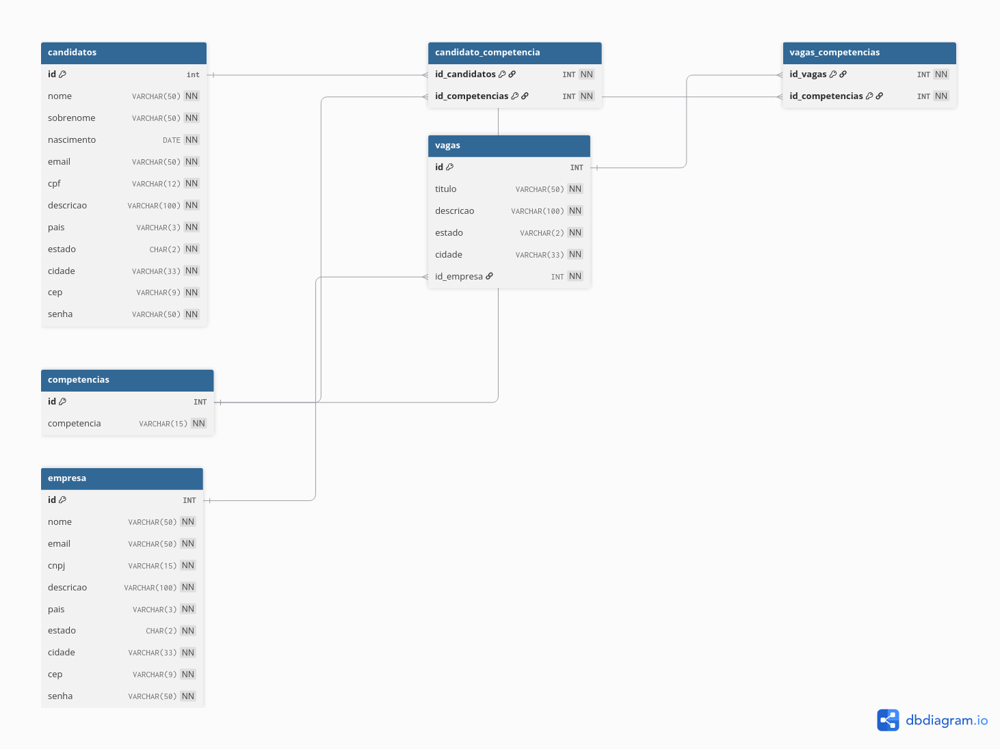

# Linketinder - Banco de Dados 

Modelagem e SQL do banco de dados do Linketinder, feito no PostgreSQL.

Diagrama feito com **dbdiagram.io**:

## Tabelas

- `candidatos`
- `empresa`
- `vagas`
- `competencias`
- `candidato_competencia` (N:N candidatos ↔ competências)
- `vagas_competencias` (N:N vagas ↔ competências)

